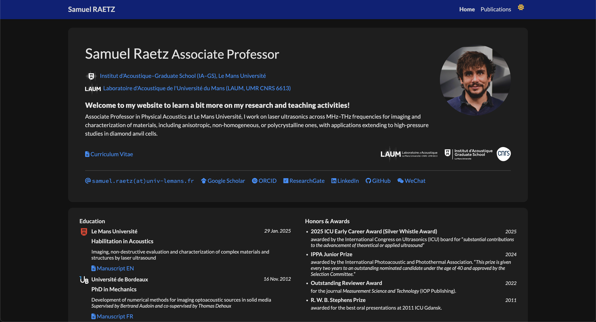

# 🌐 Personal Academic Website

This repository contains the source code for my **personal academic website**, built with **Jekyll** and **Bootstrap**, and hosted via **GitHub Pages**.

The site presents my research interests, publications, projects, teaching activities, and other professional materials in a clean, responsive layout.

> 💡 All content and design are custom-built and easily extensible for academic profiles. It is based on the excellent <a class="footer-link" href="https://github.com/luost26/academic-homepage" target="_blank"></i>🎓 academic-homepage</a>, a GitHub Pages (Jekyll) template for personal academic website.



---

## 🔗 Live Website

👉 [https://sraetz-LAUM.github.io](https://sraetz-LAUM.github.io)

---

## 🧭 About

This website includes (or will include):

- 🎓 **Education** and professional background  
- 🧪 **Research** topics and collaborations  
- 📚 **Publications**, with filters, search, and dynamic keyword highlighting
- 🧑‍🏫 **Teaching** experience  
- 💼 **Projects** and **Showcases** of work  

It’s designed to be easily maintainable: most content is stored as structured data in `_data/` or individual collection folders.

---

## ⚙️ Local Setup and Development

To preview or edit the site locally, follow these steps:

### 1️⃣ Clone the repository

```bash
git clone https://github.com/yourusername/yourrepo.git
cd yourrepo
```

### 2️⃣ Install dependencies

Ensure you have Ruby and Bundler installed, then run:

```bash
bundle install
```

### 3️⃣ Build and serve locally

```bash
bundle exec jekyll serve -l -H localhost
```
Then open http://localhost:4000 in your browser.

The site will automatically rebuild when you modify files.

---

## 📁 Repository Structure

```graphql
.
├── 404.html                # Custom not-found page
├── Gemfile / Gemfile.lock  # Ruby dependencies for Jekyll
├── LICENSE                 # License for content and code
├── _config.yml             # Main Jekyll configuration file
├── _data/                  # YAML/JSON data files (profile, awards, etc.)
├── _includes/              # Reusable HTML snippets (widgets, layouts)
├── _layouts/               # Page templates for Jekyll
├── _bibliography/          # Bibliography data for publications
├── _publications/          # Individual publication entries
├── _research/              # Research topics and sections
├── _showcase/              # Project showcases
├── _teaching/              # Teaching-related pages
├── _collaborators/         # Collaborator profiles
├── _news/                  # News or announcements
├── assets/                 # Static assets (CSS, JS, images, fonts)
├── scripts/                # Custom Python for publication markdown auto generation
├── index.html              # Home page
├── publications.html       # Publications section page
├── showcase.html           # Project showcase overview
└── _site/                  # Generated output (ignored by Git)
```

---

## 🧩 Features

🌓 Dark/Light theme toggle

🔍 Live publication search with keyword highlighting

📆 Sticky year navigation in publications

🪶 Lazy loading and smooth transitions

📱 Fully responsive layout (Bootstrap-based)

⚡ Optimized for fast loading on GitHub Pages

---

## 🪪 License

This project is licensed under the terms of the [MIT License](LICENSE).

You are free to reuse or adapt this template for your own personal website — attribution appreciated.

---

## ✨ Author

Samuel RAETZ

📍 [Institut d'Acoustique–Graduate School (IA–GS)](https://iags.univ-lemans.fr/en/index.html) 🇬🇧, [Le Mans Université](https://www.univ-lemans.fr/fr/index.html) 🇫🇷

📫 samuel.raetz[at]univ-lemans.fr

🔗 https://sraetz-LAUM.github.io